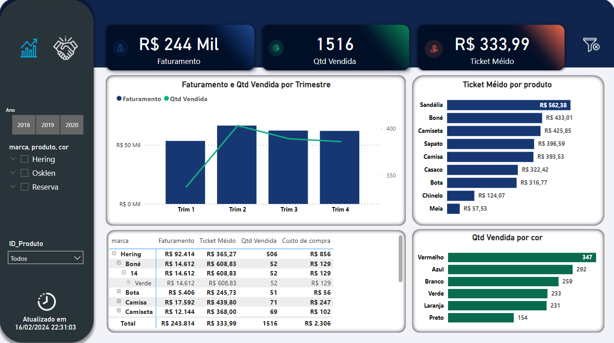
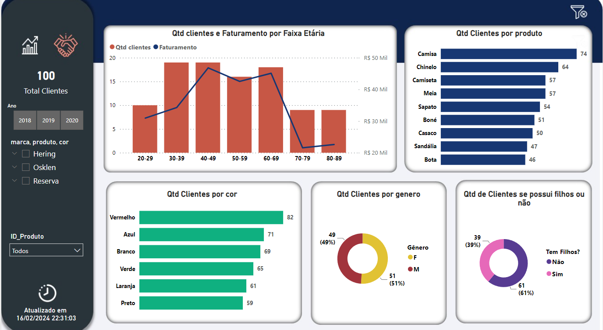

# Dash-Vendas-Airflow

## Projeto de Estudo: Pipeline de ETL e Dashboard de Vendas

### 1. Introdução

Este documento descreve o processo de desenvolvimento de um pipeline de ETL (Extract, Transform, Load) para análise de dados de vendas, utilizando as tabelas Clientes, Produtos, Vendas e a criação da Tabela Itens Pedidos. O pipeline foi desenvolvido utilizando Pandas para o tratamento dos dados, Airflow para a automação do processo e PostgreSQL para armazenamento dos dados. Por fim, foi criado um Dashboard de Vendas para visualização dos resultados.

### 2. Objetivo

O objetivo deste projeto é automatizar o processo de tratamento e análise de dados de vendas, possibilitando uma visão mais clara e rápida das informações.

### 3. Tecnologias Utilizadas

- Pandas: Para o tratamento dos dados.
- Airflow: Para a automação do pipeline.
- PostgreSQL: Para o armazenamento dos dados.
- Docker: Para a execução do Airflow em um ambiente isolado.
- Power BI: Ferramenta de visualização de dados.

### 4. Estrutura do Projeto

O projeto utiliza as seguintes tabelas como base:

- Tabela "Clientes": contendo informações dos clientes.
- Tabela "Produtos": contendo informações dos produtos.
- Tabela "Vendas": contendo informações das vendas.
- Tabela "Itens Pedidos": contendo informações dos itens pedidos nas vendas.

### 5. Desenvolvimento do Pipeline de ETL

- Extração: Os dados são extraídos das tabelas PostgreSQL utilizando consultas SQL.
- Transformação: Os dados são tratados utilizando Pandas para limpeza, transformação e agregação conforme necessário.
- Carga: Os dados tratados são inseridos na tabela "Itens Pedidos" no PostgreSQL.

### 6. Configuração do Airflow

- Um DAG (Directed Acyclic Graph) é criado no Airflow para agendar e executar o pipeline de ETL.
- O DAG é configurado com as tarefas de extração, transformação, carga e notificação de sucesso ou falha.

### 7. Scripts

- teste2.py: O pipeline foi desenvolvido utilizando Pandas para o tratamento dos dados, Airflow para a automação do processo.
- dag_exectite_sql.py: Criação e inserção de dados no banco.
- create_table_db.sql: Script SQL para criação de tabelas.

### 8. Criação do Dashboard de Vendas

Utilizando o Power BI (ou outra ferramenta), é criado um dashboard que se conecta ao banco de dados PostgreSQL e carrega os dados da tabela "Vendas". O dashboard contém visualizações interativas para análise de vendas por cliente, produto, período, etc.

### 9. Observações

Recentemente, desenvolvi meu primeiro projeto de estudo envolvendo pandas, Airflow, PostgreSQL, Docker e Power BI. Foi uma experiência incrível, mas sei que ainda há muito a melhorar. Pretendo adicionar mais parâmetros, realizar validações mais robustas e refatorar o código para deixá-lo mais limpo e eficiente.

### 10. Conclusão

Este projeto demonstra como criar um pipeline de ETL utilizando Pandas e Airflow para automatizar o tratamento de dados e a inserção em um banco de dados PostgreSQL, culminando na criação de um Dashboard de Vendas para análise dos dados. Este tipo de projeto é útil para empresas que desejam otimizar seus processos de análise de dados e tomada de decisão.

### 11. Referências

- Planilhas: Utilizei planilhas fornecidas em um teste.
- Estudos: Aprendi conceitos-chave através do canal Codifike no YouTube, absorvendo conhecimento relevante para o projeto. [Link do Canal Codifike](https://www.youtube.com/@Codifike)
- Layout do Dashboard: Me inspirei no Dashboard de Vendas do Leonardo Karpinsk, buscando um design eficiente e atraente para meu projeto. [Link do Canal Xperiun_](https://www.youtube.com/@Xperiun_)
