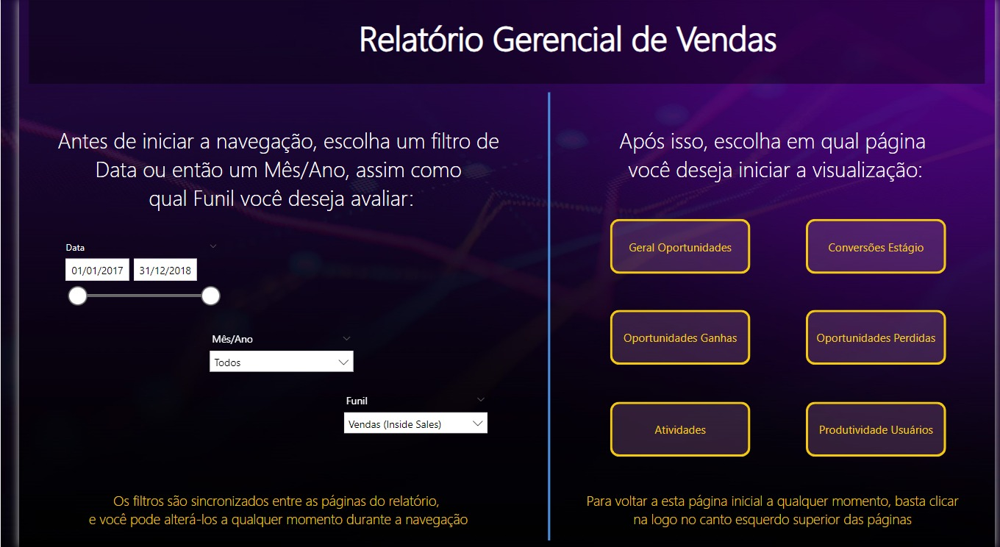
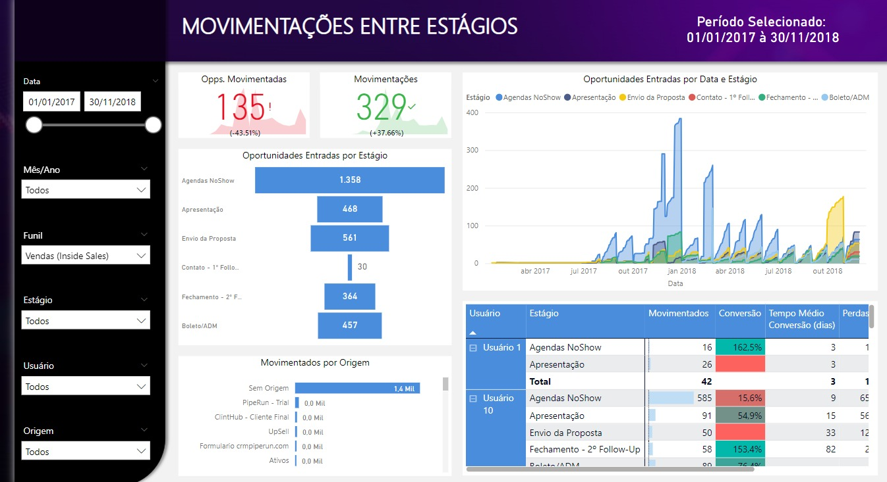
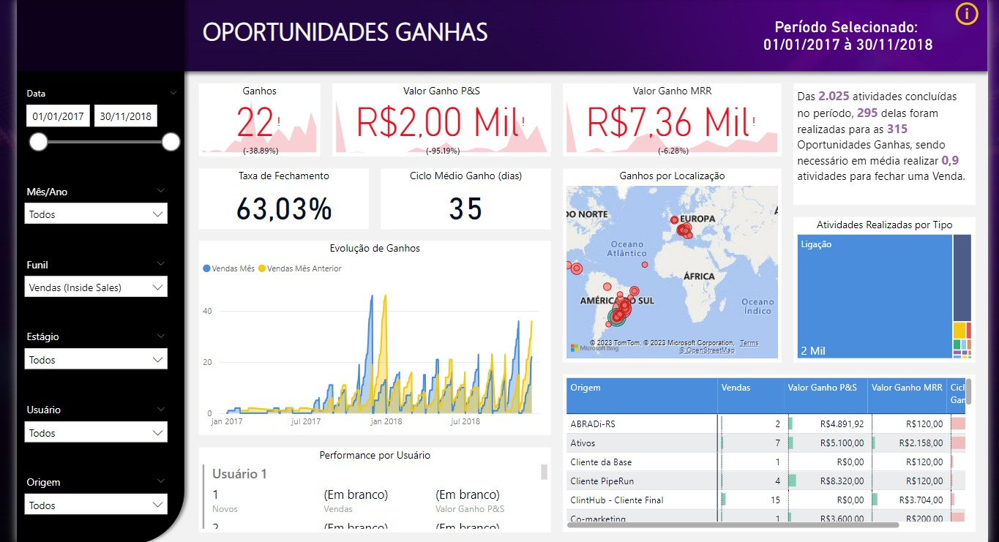
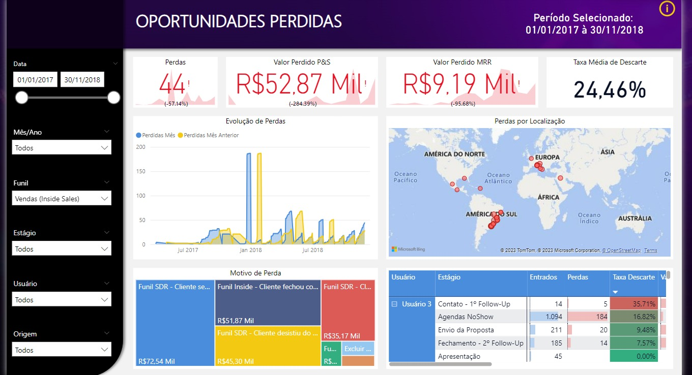
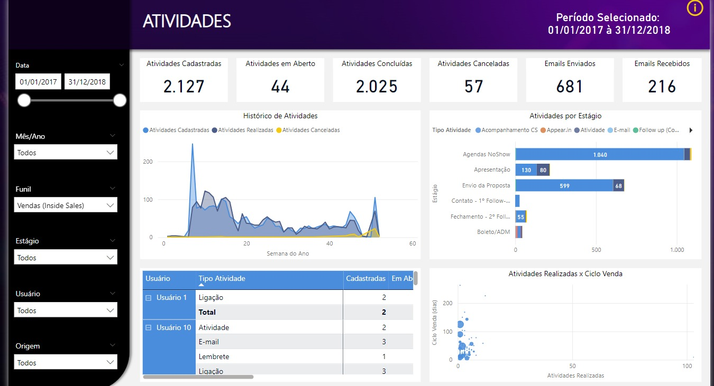
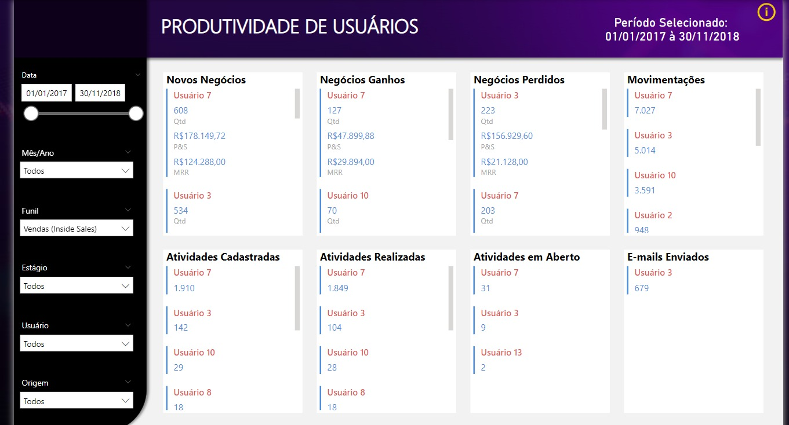

# Dashboard-CRM

Aprendizado do curso Power BI Experience, ministrado pelo Leonardo Karpinsk

Um dashboard de CRM, ou Customer Relationship Management, é uma ferramenta essencial para as organizações
que desejam gerenciar e aprimorar seus relacionamentos com os clientes.

