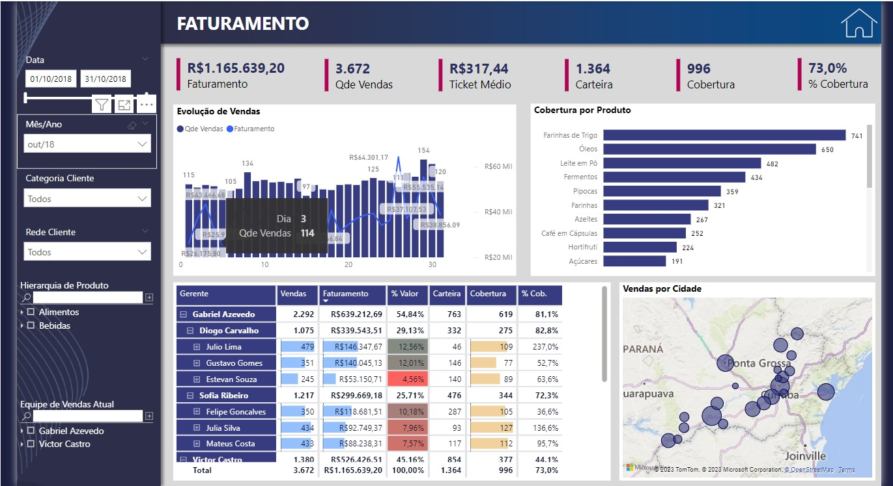
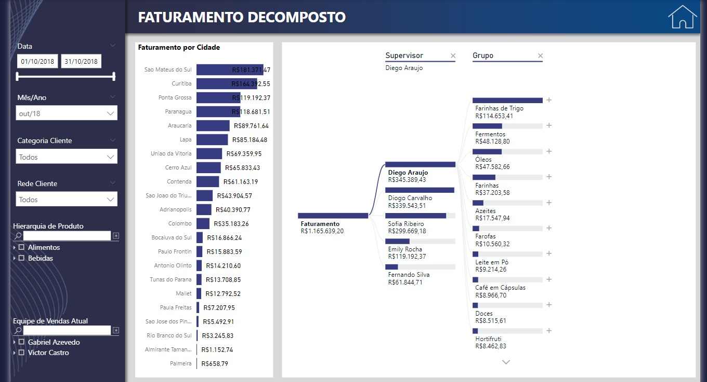
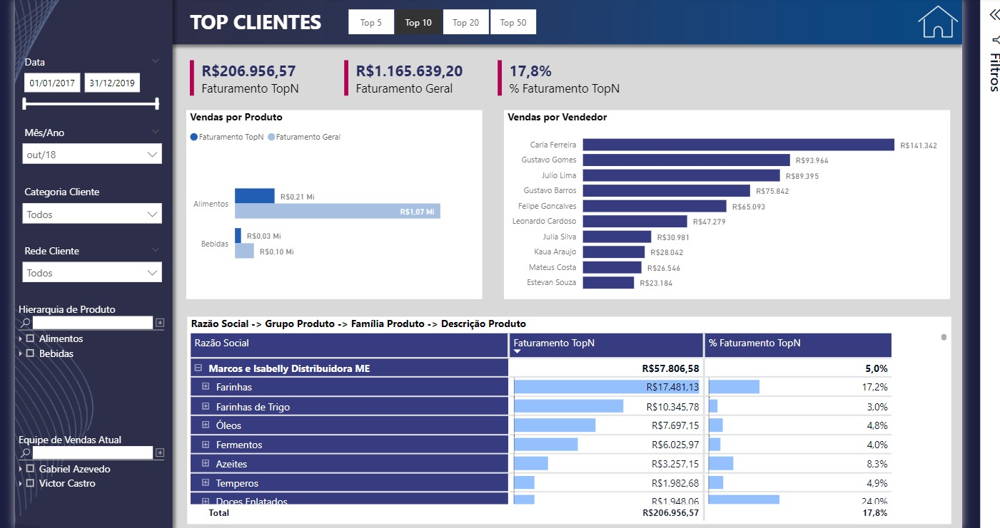
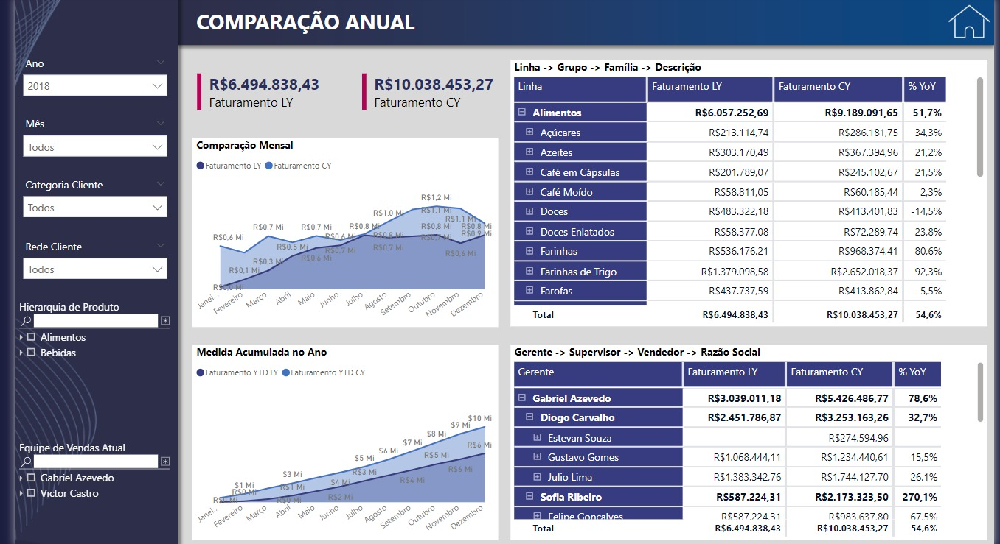
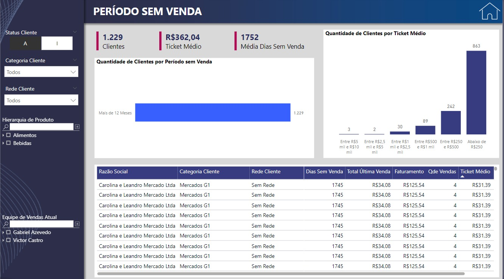
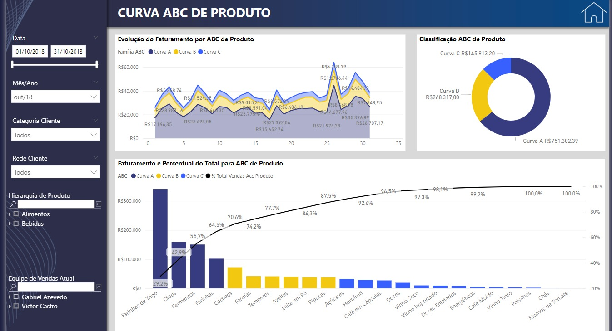
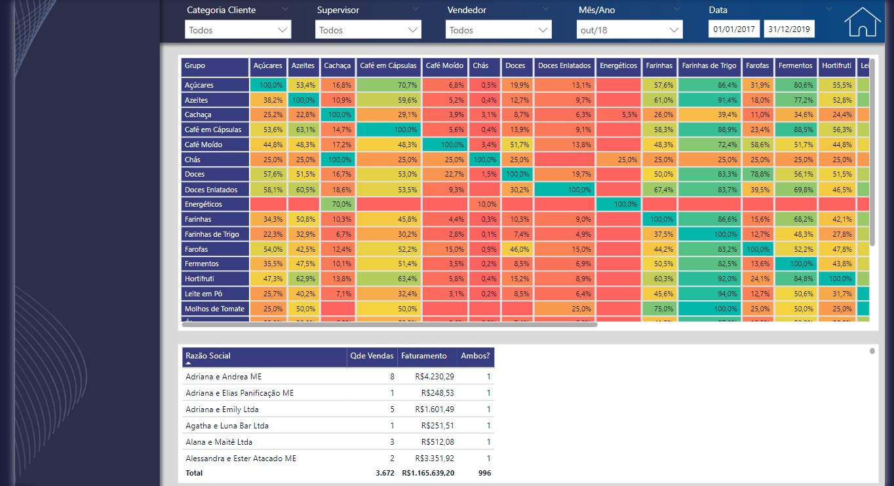
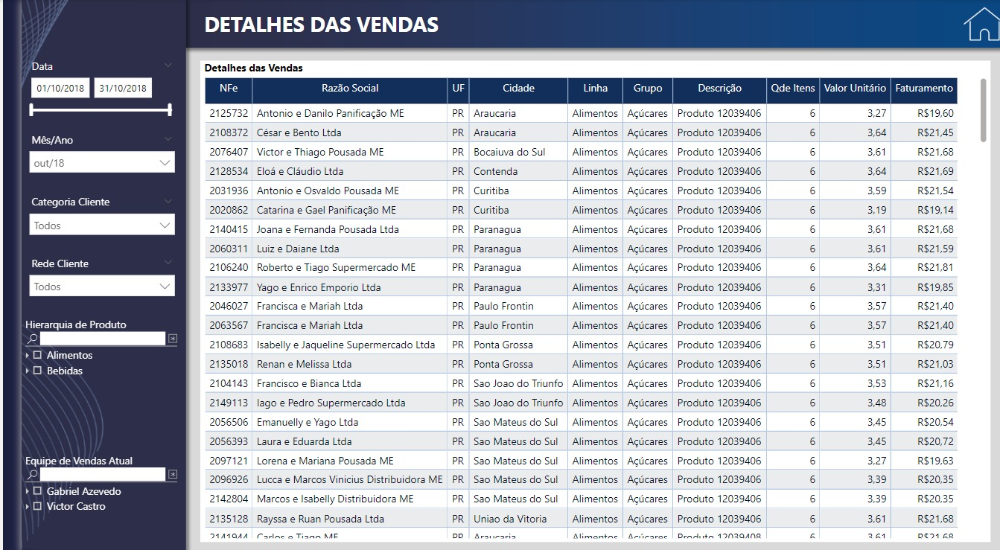

# Dashboard-Comercial

Aprendizado do Curso Power BI Experience ministrado pelo Leonardo Karpinsk

Faturamento: Essa seção provavelmente exibe os números totais de faturamento da sua empresa em um período específico. É uma métrica-chave para avaliar a saúde financeira da sua organização.

Faturamento Decomposto: Aqui, você provavelmente quebra o faturamento total em diferentes categorias ou segmentos, permitindo uma análise mais granular das fontes de receita e identificando áreas de destaque ou preocupação.

Top Clientes: Esta seção destaca os clientes que geraram mais receita para a sua empresa. Pode ser útil para reconhecer a importância de clientes-chave e desenvolver estratégias para manter ou expandir seus negócios.

Comparação Anual: Uma análise anual do desempenho de vendas é essencial para identificar tendências ao longo do tempo. Essa seção pode ajudar a visualizar o crescimento ou declínio das vendas e definir metas realistas para o futuro.

Período sem Venda: Isso pode mostrar intervalos de tempo em que sua empresa não realizou vendas. Pode ser útil para identificar momentos de baixa atividade e avaliar as razões por trás disso.

ABC Produto: A análise ABC classifica seus produtos em três categorias: A (produtos de alta prioridade), B (produtos de média prioridade) e C (produtos de baixa prioridade). Essa seção pode ajudar na gestão de estoque e estratégias de marketing.

Cross-Sell: Esta seção pode destacar oportunidades de venda cruzada, ou seja, sugerir produtos relacionados que os clientes possam estar interessados em adquirir junto com seu pedido atual.

Detalhes de Vendas: Aqui, você pode disponibilizar informações mais detalhadas sobre transações individuais, como datas, valores, produtos comprados e clientes. Isso é útil para uma análise mais profunda do desempenho de vendas.

