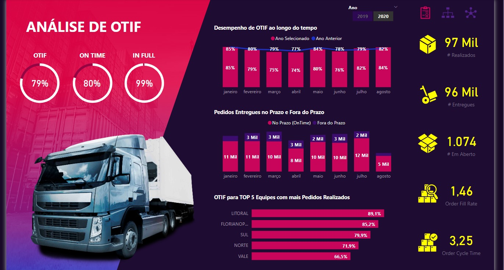

# Dashboard-Logistica-Calculo-OTIF

Paineis de controle de logística com foco no cálculo de OTIF (On-Time In-Full) 
é uma ferramenta de gerenciamento que fornece informações essenciais relacionadas à eficiência da cadeia de suprimentos e à entrega de produtos.

