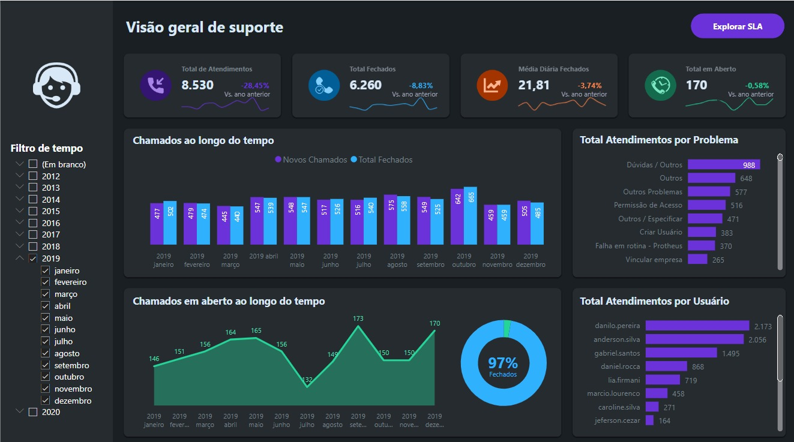
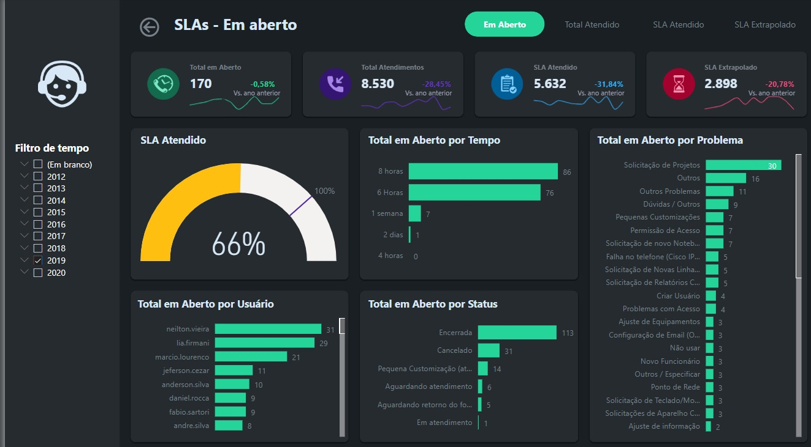
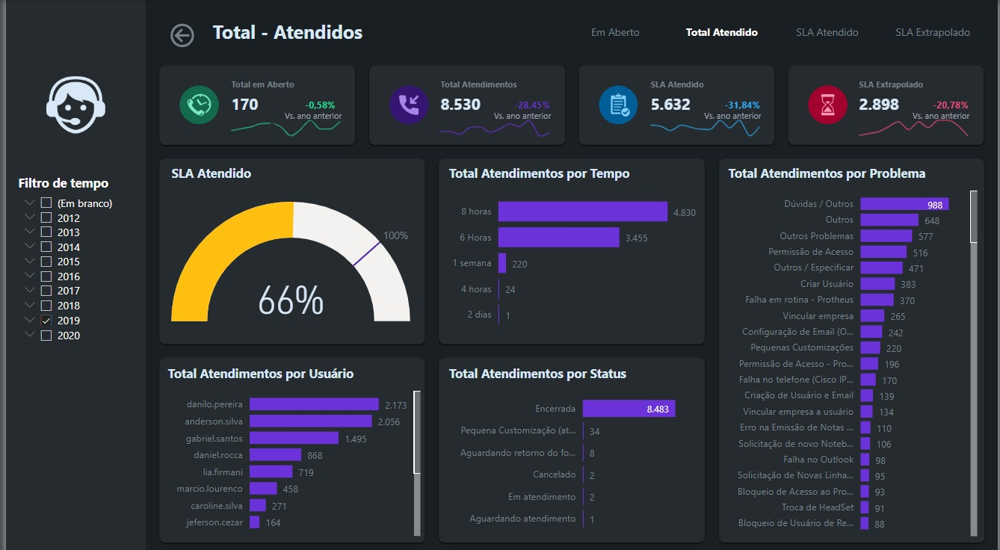
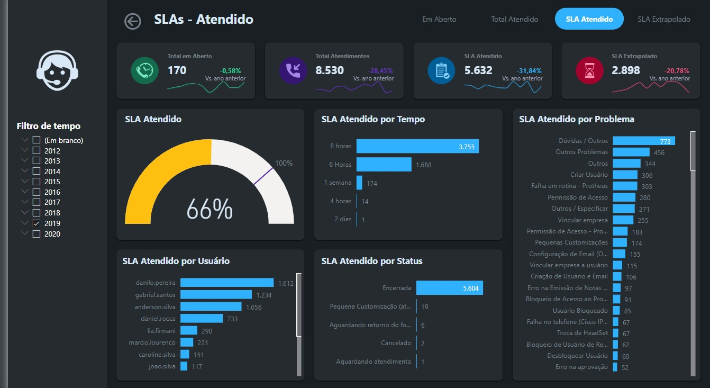
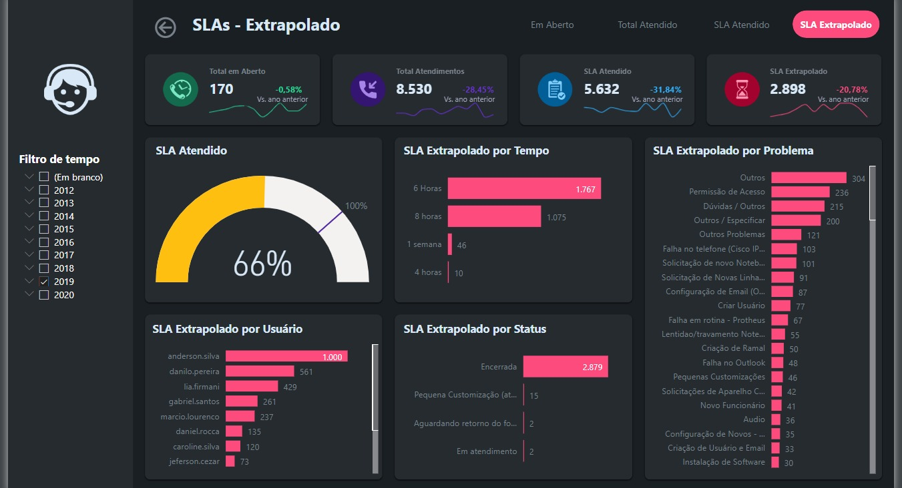

# Dashboard-SAC

Uma Dashboard do SAC (Serviço de Atendimento ao Cliente) é uma ferramenta visual que fornece informações importantes e métricas relacionadas ao atendimento ao cliente de uma empresa. Ela desempenha um papel fundamental na gestão do relacionamento com o cliente e na melhoria contínua dos processos de atendimento. Aqui estão algumas razões pelas quais uma Dashboard do SAC é importante:

- Home

- Dash

- Em aberto

- SLAs Atendidos

- SLA Atendido

- SLA Extrapolado

